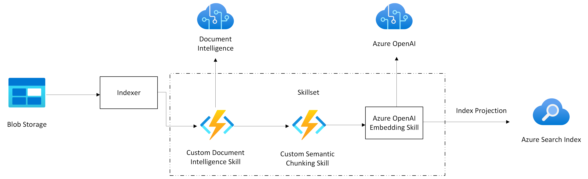

# Readme for semantic chunking demo

This end-to-end sample demonstrates how to deploy [Document Intelligence](https://learn.microsoft.com/azure/ai-services/document-intelligence/overview?view=doc-intel-4.0.0) for [semantic chunking](https://learn.microsoft.com/azure/ai-services/document-intelligence/concept-retrieval-augmented-generation?view=doc-intel-4.0.0). Semantic chunking divides the text into chunks based on semantic understanding. Division boundaries are focused on sentence subject, maintaining semantic consistency within each chunk. It's useful for text summarization, sentiment analysis, and document classification tasks.

API calls to Document Intelligence come from an Azure function app. This function is used as a [custom skill](https://learn.microsoft.com/azure/search/cognitive-search-custom-skill-web-api) to automatically convert documents to Markdown and chunk them in Azure AI Search.

This sample uses [indexer-based indexing](https://learn.microsoft.com/azure/search/search-howto-create-indexers) with a [skillset](https://learn.microsoft.com/azure/search/cognitive-search-defining-skillset) having two [custom skills](https://learn.microsoft.com/azure/search/cognitive-search-custom-skill-web-api) to automatically extract and chunk documents in a [blob data source](https://learn.microsoft.com/azure/search/search-howto-indexing-azure-blob-storage). The code vectorizes those chunks using an Azure OpenAI embedding model.

All resources and sample data are deployed automatically, resulting in a populated vector index on Azure AI Search that's ready to query.

You can create or use an existing Azure AI Search and Azure OpenAI account with a deployed embedding model, but the script creates the following new resources always:

+ Resource group
+ Document Intelligence
+ Application Insights
+ App Service plan
+ Log Analytics workspace
+ Storage account
+ Azure function apps

## Architecture Diagram



## Prerequisites

+ [azd](https://learn.microsoft.com/azure/developer/azure-developer-cli/install-azd), used to deploy all Azure resources and assets used in this sample.

+ You should have an **Owner** role assignment at the subscription level, and all resources should be in the same subscription.

This sample uses the [Azure Python SDK](https://learn.microsoft.com/python/api/azure-search-documents/?view=azure-python-preview) for indexing and vector query operations.

We recommend creating a virtual environment so that you can control which package versions are used. Use Ctrl+shift+P to open a command palette. Search for `Python: Create environment`. Select `Venv` to create an environment within the current workspace. When prompted, select `scripts\requirements.txt` and `api\functions-requirements.txt` for the dependencies.

## Set variables and run the script

This sample uses [`azd`](https://learn.microsoft.com/azure/developer/azure-developer-cli/) and a bicep template to deploy all Azure resources, including Azure AI Search. To use an existing search service, set environment variables before running `azd up`.

1. Open a command line prompt at the sample folder (/demo-python/code/indexers/document-intelligence-custom-skill).

1. If you're a member of multiple tenants and subscriptions, get your Azure subscription and tenant IDs: `az account show`

1. To specify a subscription, create an environment: `azd env new "<PROVIDE AN ENVIRONMENT NAME>" --subscription "<PROVIDE YOUR SUBSCRIPTION ID>"`

1. To specify your Azure tenant: `azd auth login --tenant-id "<PROVIDE YOUR TENANT ID>"`

1. Optionally, enter variables if you have an existing search service or Azure OpenAI account. Otherwise, the script creates all resources for you.

   + `azd env set AZURE_SEARCH_SERVICE <your-search-service-name>`. Provide just the service name.
   + `azd env set AZURE_SEARCH_SERVICE_LOCATION <your-search-service-region>`. Provide a quote-enclosed string if using a full name, such as "West US2".
   + `azd env set AZURE_SEARCH_SERVICE_RESOURCE_GROUP <your-search-service-resource-group>`.
   + `azd env set AZURE_SEARCH_SERVICE_SKU <your-search-service-sku>`. Valid values are case-sensitive: `basic`, `standard`, `standard2`, `standard3`,`storage_optimized_l1`, `storage_optimized_l2`
   + `azd env set AZURE_OPENAI_ACCOUNT <your-openai-account>`
   + `azd env set AZURE_OPENAI_EMB_DEPLOYMENT <your-openai-embedding-deployment-name>`
   + `azd env set AZURE_OPENAI_EMB_MODEL <your-openai-embedding-model-name>`
   + `azd env set AUZRE_OPENAI_EMB_MODEL_DIMENSIONS <your-openai-embedding-model-dimensions>`. Only required if you want to use dimensions other than 1536 for `text-embedding-3-large` or `text-embedding-3-small`
   + `azd env set AZURE_OPENAI_LOCATION <your-openai-location>`. Provide a quote-enclosed string if using a full name, such as "West US2"

   The full set of parameters are located in the `/infra/main.bicepparam` file. 

1. Optionally, verify the environment variables that are session-based: `azd env get-values`. You should also review the `main.bicepparam` file for the full parameter list. Several parameters have default values. Change any that aren't valid for your subscription or scenario.

1. Run `azd up`.

   + Choose your Azure subscription.
   + Enter a development environment name.
   + Enter a region for the function app.

   If you aren't prompted for an environment or region, retry `azd env new` to specify a new environment.

   The deployment creates multiple Azure resources and runs multiple jobs. It takes several minutes to complete. The deployment is complete when you get a command line notification stating "SUCCESS: Your up workflow to provision and deploy to Azure completed."

1. Open the [notebook](./document-intelligence-custom-skill.ipynb) to run sample queries once the sample is provisioned and the indexer has finished running.

1. If you can't run the queries, navigate to your search service in the Azure portal and confirm the document-intelligence-index exists and has a positive document count. You should also check the indexer for errors.

1. If the index, indexer, and other objects don't exist, rerun the script for object creation. Object creation won't occur if your function app isn't fully warmed up when `azd` gets to this step. To create the objects manually, open a PowerShell prompt and run  `./scripts/setup_search_service.ps1` at the command line.

   You should see the following output statements:

   ```bash
   Uploading sample data...
   Getting function URL...
   Create or update sample index document-intelligence-index...
   Create or update sample data source document-intelligence-datasource...
   Create or update sample skillset document-intelligence-skillset
   Create or update sample indexer document-intelligence-indexer
   ```

1. If you get **HttpResponseError: Operation returned an invalid status 'Forbidden'**, make sure that your Azure resources have key-based authentication enabled. This sample uses API keys. For Azure AI Search, you can use the Azure portal and the **Settings** > **Keys** page to confirm that either the **API keys** or the **Both** option is enabled.