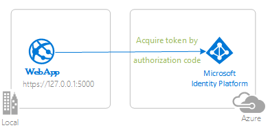
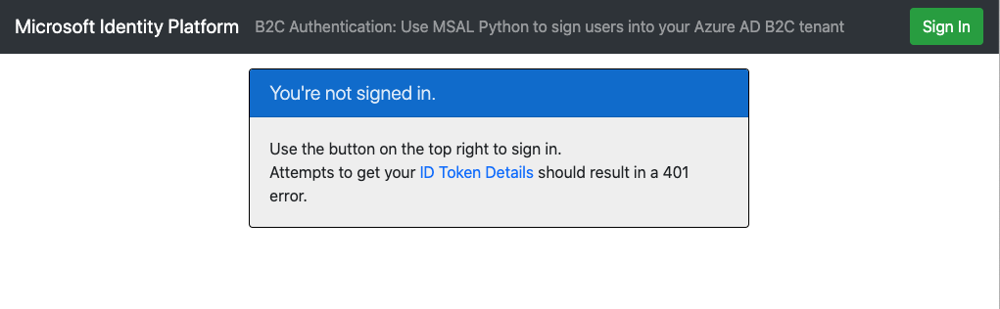

# Enable your Python Flask webapp to sign in users to your Azure Active Directory B2C tenant with the Microsoft identity platform

- [Enable your Python Flask webapp to sign in users to your Azure Active Directory B2C tenant with the Microsoft identity platform](#enable-your-python-flask-webapp-to-sign-in-users-to-your-azure-active-directory-b2c-tenant-with-the-microsoft-identity-platform)
  - [Overview](#overview)
  - [Scenario](#scenario)
  - [Contents](#contents)
  - [Prerequisites](#prerequisites)
  - [Setup](#setup)
    - [Step 1: Clone or download this repository](#step-1-clone-or-download-this-repository)
    - [Step 2: Install project dependencies](#step-2-install-project-dependencies)
    - [Register the sample application with your Azure AD B2C tenant](#register-the-sample-application-with-your-azure-ad-b2c-tenant)
    - [Choose the Azure AD B2C tenant where you want to create your applications](#choose-the-azure-ad-b2c-tenant-where-you-want-to-create-your-applications)
    - [Create User Flows and Custom Policies](#create-user-flows-and-custom-policies)
    - [Add External Identity Providers](#add-external-identity-providers)
    - [Register the webapp (b2c-python-flask-webapp-auth)](#register-the-webapp-b2c-python-flask-webapp-auth)
  - [Running the sample](#running-the-sample)
  - [Explore the sample](#explore-the-sample)
  - [We'd love your feedback!](#wed-love-your-feedback)
  - [About the code](#about-the-code)
    - [Under the hood](#under-the-hood)
  - [Deploy to Azure](#deploy-to-azure)
  - [More information](#more-information)
  - [Community Help and Support](#community-help-and-support)
  - [Contributing](#contributing)
  - [Code of Conduct](#code-of-conduct)

<!-- -->

## Overview

This sample demonstrates a Python Flask webapp that authenticates users with Azure Active Directory B2C (Azure AD B2C) using the the [Microsoft Authentication Library \(MSAL\) for Python](https://github.com/AzureAD/microsoft-authentication-library-for-python).

## Scenario

1. The Web application uses **MSAL for Python** to sign-in a user and obtains an [ID Token](https://docs.microsoft.com/azure/active-directory/develop/id-tokens) from **Azure AD B2C**.
1. The **ID Token** proves that the user has successfully authenticated against an **Azure AD B2C** tenant.
1. The web application protects one of its routes according to user's authentication status.
1. The user can sign up for a new account, reset password, or edit user profile information using B2C [user-flows](https://docs.microsoft.com/azure/active-directory-b2c/user-flow-overview)



## Contents

| File/folder       | Description                                |
|-------------------|--------------------------------------------|
|`app.py`           | The sample app code.                       |
|`CHANGELOG.md`     | List of changes to the sample.             |
|`CONTRIBUTING.md`  | Guidelines for contributing to the sample. |
|`LICENSE`          | The license for the sample.                |

## Prerequisites

- [Python 3.8](https://www.python.org/downloads/)
- A virtual environment to install packages from [requirements.txt](requirements.txt)
- An **Azure AD B2C** tenant. For more information see: [How to get an Azure AD B2C tenant](https://docs.microsoft.com/azure/active-directory-b2c/tutorial-create-tenant) (optional)

## Setup

### Step 1: Clone or download this repository

From your shell or command line:

```Shell
git clone https://github.com/Azure-Samples/ms-identity-b2c-python-flask-webapp-authentication.git
```

or download and extract the repository .zip file.

### Step 2: Install project dependencies

1. Navigate to the project folder
2. Activate a Python 3 virtual environment
3. Install project dependencies

- In Linux/OSX via the terminal:

```Shell
  cd <project-root-directory> # the folder into which you cloned this project
  python3 -m venv venv # only required to create the venv if you don't have a venv already
  source venv/bin/activate # activates the venv
  pip install -r requirements.txt
```

- In Windows via PowerShell:

```PowerShell
  cd <project-root-directory> # the folder into which you cloned this project
  python3 -m venv venv # only required to create the venv if you don't have a venv already
  Set-ExecutionPolicy -ExecutionPolicy RemoteSigned -Scope Process -Force
  . .\venv\Scripts\Activate.ps1 # activates the venv
  pip install -r requirements.txt
```

### Register the sample application with your Azure AD B2C tenant

:warning: This sample comes with a pre-registered application for testing purposes. If you would like to use your own **Azure AD B2C** tenant and application, follow the steps below to register and configure the application in the **Azure Portal**. Otherwise, continue with the steps for [Running the sample](#running-the-sample).

<details>
  <summary>Expand this section to see manual steps for configuring your own tenant:</summary>

### Choose the Azure AD B2C tenant where you want to create your applications

As a first step you'll need to:

1. Sign in to the [Azure portal](https://portal.azure.com).
1. If your account is present in more than one **Azure AD B2C** tenant, select your profile at the top right corner in the menu on top of the page, and then **switch directory** to change your portal session to the desired Azure AD B2C tenant.

### Create User Flows and Custom Policies

Please refer to [Tutorial: Create user flows in Azure Active Directory B2C](https://docs.microsoft.com/azure/active-directory-b2c/tutorial-create-user-flows) to create common user flows like sign up, sign in, edit profile, and password reset.

You may consider creating [Custom policies in Azure Active Directory B2C](https://docs.microsoft.com//azure/active-directory-b2c/custom-policy-overview) as well, however, this is beyond the scope of this tutorial.

### Add External Identity Providers

Please refer to: [Tutorial: Add identity providers to your applications in Azure Active Directory B2C](https://docs.microsoft.com/azure/active-directory-b2c/tutorial-add-identity-providers)

### Register the webapp (b2c-python-flask-webapp-auth)

1. Navigate to the [Azure portal](https://portal.azure.com) and select the **Azure AD B2C** service.
1. Select the **App Registrations** blade on the left, then select **New registration**.
1. In the **Register an application page** that appears, enter your application's registration information:
   - In the **Name** section, enter a meaningful application name that will be displayed to users of the app, for example `b2c-python-flask-webapp-auth`.
   - Under **Supported account types**, select **Accounts in any identity provider or organizational directory (for authenticating users with user flows)**.
   - In the **Redirect URI (optional)** section, select **Web** in the combo-box and enter the following redirect URI: `https://127.0.0.1:5000/auth/redirect`.
1. Select **Register** to create the application.
1. In the app's registration screen, find and note the **Application (client) ID**. You use this value in your app's configuration file(s) later in your code.
1. Select **Save** to save your changes.

1. In the app's registration screen, click on the **Certificates & secrets** blade in the left to open the page where we can generate secrets and upload certificates.
1. In the **Client secrets** section, click on **New client secret**:
   - Type a key description (for instance `app secret`),
   - Select one of the available key durations (**In 1 year**, **In 2 years**, or **Never Expires**) as per your security concerns.
   - The generated key value will be displayed when you click the **Add** button. Copy the generated value for use in the steps later.
   - You'll need this key later in your code's configuration files. This key value will not be displayed again, and is not retrievable by any other means, so make sure to note it from the Azure portal before navigating to any other screen or blade.

#### Configure the webapp (b2c-python-flask-webapp-auth) to use your app registration

Open the project in your IDE (like **Visual Studio Code**) to configure the code.

> In the steps below, "ClientID" is the same as "Application ID" or "AppId".

1. Open the `aad.b2c.config.json` file
1. Find the key `client.client_id` and replace the existing value with the application ID (clientId) of the `b2c-python-flask-webapp-auth` application copied from the Azure portal.
1. Find the key `client.client_credential` and replace the existing value with the client secret you saved during the creation of the `b2c-python-flask-webapp-auth` app, in the Azure portal.
1. Find the key `client.authority` and replace the the two instances of `fabrikamb2c` with the name of the Azure AD B2C tenant in which you registered the app.
1. Find the key `b2c.susi` and set the value to the name of your sign-up/sign-in userflow policy you created in your AAD B2C tenant.
1. Find the key `b2c.profile` and set the value to the name of your sign-up/sign-in userflow policy you created in your AAD B2C tenant.
1. Find the key `b2c.password` and set the value to the name of your sign-up/sign-in userflow policy you created in your AAD B2C tenant.

</details>

## Running the sample

- To run the sample, open a terminal window. Navigate to the root of the project. Be sure your virtual environment with dependencies is activated ([Prerequisites](#prerequisites)).
- On Linux/OSX via the terminal:

  ```Shell
    export FLASK_APP=app.py
    export FLASK_ENV=development
    export FLASK_DEBUG=1
    export FLASK_RUN_CERT=adhoc
    flask run
  ```

- On Windows:

  ```PowerShell
    $env:FLASK_APP="app.py"
    $env:FLASK_ENV="development"
    $env:FLASK_DEBUG="1"
    $env:FLASK_RUN_CERT="adhoc"
    flask run
  ```

- Alternatively, you may use `python -m flask run` instead of `flask run`
- Navigate to [https://127.0.0.1:5000](https://127.0.0.1:5000) in your browser

> You might run into an invalid certificate error on your browser as we are using self-signed certificates for `https`. If you do, you can ignore that error while running this sample locally.



## Explore the sample

- Note the signed-in or signed-out status displayed at the center of the screen.
- Click the context-sensitive button at the top right (it will read `Sign In` on first run)
- Follow the instructions on the next page to sign in with an account of your chosen identity provider.
- Note the context-sensitive button now says `Sign out` and displays your username to its left.
- The middle of the screen now has an option to click for **ID Token Details**: click it to see some of the ID token's decoded claims.
- You also have the option of editing your profile. Click the link to edit details like your display name, place of residence, and profession.
- You can also use the button on the top right to sign out.
- After signing out, click the link to `ID Token Details` to observe how the app displays a `401: unauthorized` error instead of the ID token claims.

> :information_source: Did the sample not work for you as expected? Did you encounter issues trying this sample? Then please reach out to us using the [GitHub Issues](../issues) page.

## We'd love your feedback!

Were we successful in addressing your learning objective? Consider taking a moment to [share your experience with us](https://forms.office.com/Pages/ResponsePage.aspx?id=v4j5cvGGr0GRqy180BHbR73pcsbpbxNJuZCMKN0lURpUM0dYSFlIMzdHT0o3NlRNVFpJSzcwRVMxRyQlQCN0PWcu).

## About the code

This sample uses the [Microsoft Authentication Library \(MSAL\) for Python](https://github.com/AzureAD/microsoft-authentication-library-for-python) to sign up and/or sign in users with an Azure AD B2C tenant. It leverages the IdentityWebPython class found in the [Microsoft Identity Python Samples Common](https://github.com/azure-samples/ms-identity-python-samples-common) repository to allow for quick app setup.

In `app.py`'s `def create_app` method:

1. A configuration object is parsed from [aad.b2c.config.json](./aad.config.json)
1. A FlaskAdapter is instantiated for interfacing with the Flask app
1. The FlaskAdapter and an Azure AD configuration object are used to instantiate **IdentityWebPython**.

    ```python
    aad_configuration = AADConfig.parse_json('aad.b2c.config.json')
    adapter = FlaskContextAdapter(app)
    ms_identity_web = IdentityWebPython(aad_configuration, adapter)
    ```

- These three lines of code automatically hook up all necessary endpoints for the authentication process into your Flask app under a route prefix (`/auth` by default). For example, the redirect endpoint is found at `/auth/redirect`.
- When a user navigates to `/auth/sign_in` and completes a sign-in attempt, the resulting identity data is put into the session, which can be accessed through the flask global **g** object at `g.identity_context_data`.
- When an endpoint is decorated with `@ms_identity_web.login_required`, the application only allows requests to the endpoint from authenticated (signed-in) users. If the user is not signed-in, a `401: unauthorized` error is thrown, and the browser is redirected to the 401 handler.

    ```python
    @app.route('/a_protected_route')
    @ms_identity_web.login_required
    def a_protected_route():
      return "if you can see this, you're signed in!"
    ```

### Under the hood

In this sample, much of the required MSAL for Python configurations are automatically setup using utilities found in [Microsoft Identity Python Samples Common](https://github.com/azure-samples/ms-identity-python-samples-common). For a more direct, hands-on demonstration of the sign-in process without this abstraction, please see the code within this [Python Webapp](https://github.com/azure-samples/ms-identity-python-webapp) sample.

At a minimum, following parameters need to be provided to the MSAL for Python library:

- The **Client ID** of the app
- The **Client Credential**, which is a requirement for Confidential Client Applications
- The **Azure AD B2C Authority** concatenated with an appropriate **UserFlowPolicy** for *sign-up-sign-in* or *profile-edit* or *password-reset*.

1. The first step of the sign-in process is to send a request to the `/authorize` endpoint on Azure Active Directory.

1. An MSAL for Python **ConfidentialClientApplication** instance is created by ms_identity_web, like so:

    ```python
    client_instance = msal.ConfidentialClientApplication(
      client_id=CLIENT_ID,
      client_credential=CLIENT_CREDENTIAL,
      authority=f'{AUTHORITY}/{B2C_SIGN_UP_SIGN_IN_USER_FLOW_POLICY}',
    )
    ```

1. The `client_instance` instance is leveraged to construct a `/authorize` request URL with the appropriate parameters, and the browser is redirected to this URL.
1. The user is presented with a sign-in prompt by Azure Active Directory B2C. If the sign-in attempt is successful, the user's browser is redirected back to this app's `/redirect` endpoint. A successful request to this endpoint will contain an **authorization code**.
1. The `client_instance` is used to exchange this authorization code for an ID Token and Access Token from Azure Active Directory.

    ```python
    token_acquisition_result = client_instance.acquire_token_by_authorization_code(authorization_code, SCOPES)
    # this sends the authorization code to Azure AD's `/token` endpoint to request a token.
    ```

1. If the request is successful, MSAL for Python validates the signature and nonce of the incoming token. If these checks succeed, it returns the resulting `id_token`, `access_token` and plaintext `id_token_claims` in a dictionary. *It is the application's responsibility to store these tokens securely.*

## Deploy to Azure

Follow [this guide](https://github.com/Azure-Samples/ms-identity-python-flask-deployment) to deploy this app to **Azure App Service**.

## More information

- [Microsoft Authentication Library \(MSAL\) for Python](https://github.com/AzureAD/microsoft-authentication-library-for-python)
- [MSAL Python ReadTheDocs](https://msal-python.readthedocs.io/en/latest/)
- [What is Azure Active Directory B2C?](https://docs.microsoft.com/azure/active-directory-b2c/overview)
- [Application types that can be used in Active Directory B2C](https://docs.microsoft.com/azure/active-directory-b2c/application-types)
- [Recommendations and best practices for Azure Active Directory B2C](https://docs.microsoft.com/azure/active-directory-b2c/best-practices)
- [Azure AD B2C session](https://docs.microsoft.com/azure/active-directory-b2c/session-overview)
- [MSAL code samples](https://docs.microsoft.com/azure/active-directory/develop/sample-v2-code)

## Community Help and Support

Use [Stack Overflow](https://stackoverflow.com/questions/tagged/msal) to get support from the community.
Ask your questions on Stack Overflow first and browse existing issues to see if someone has asked your question before.
Make sure that your questions or comments are tagged with [`azure-active-directory` `ms-identity` `adal` `msal`].

If you find a bug in the sample, please raise the issue on [GitHub Issues](../../issues).

To provide a recommendation, visit the following [User Voice page](https://feedback.azure.com/forums/169401-azure-active-directory).

## Contributing

This project welcomes contributions and suggestions. Most contributions require you to agree to a Contributor License Agreement (CLA) declaring that you have the right to, and actually do, grant us the rights to use your contribution. For details, visit https://cla.opensource.microsoft.com.

## Code of Conduct

This project has adopted the Microsoft Open Source Code of Conduct. For more information see the Code of Conduct FAQ or contact opencode@microsoft.com with any additional questions or comments.
